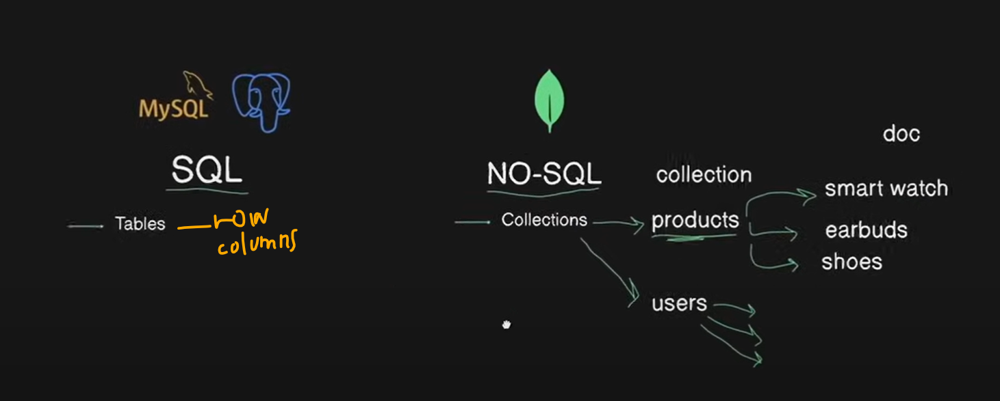
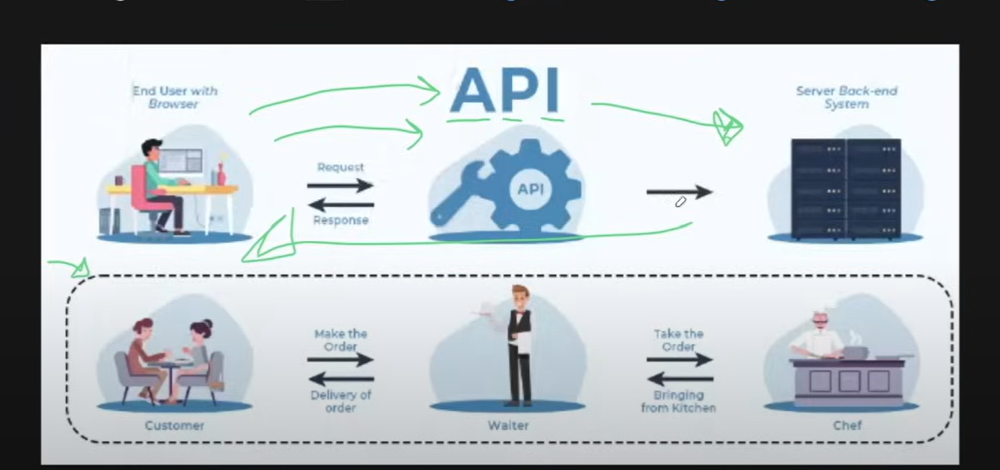
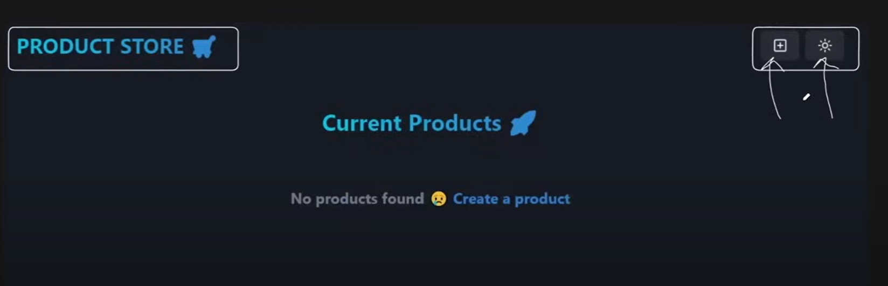
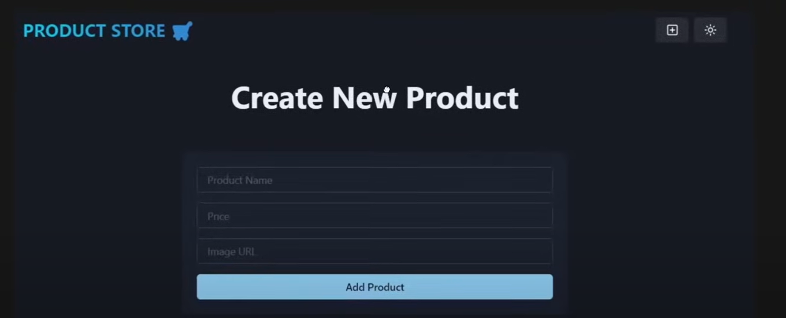
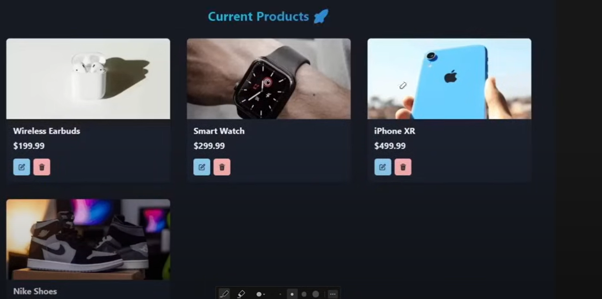
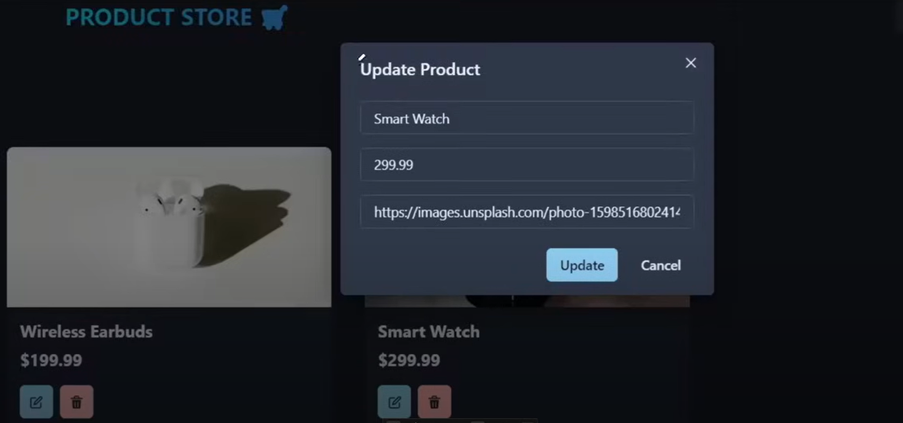

# BACKEND

1. npm init -y -> in base folder, to the easy of deployment

2. install required packages

    - express
    - mongoose
    - dotenv

        ```bash
        npm i express mongoose dotenv
        ```

3. nodemon configuration as "dev" to start

    ```json
    "scripts": {
     "dev": "nodemon backend/server.js"
    },
    "type": "module",
    ```

4. import express and set listening port

5. Setting up MongoDB

    - Create Cluster
    - Copy PW & Create User
    - Network access --> Allow access from anywhere
    - Create DB

6. Put MongoURI into dotenv and import env and config in server.js

```env
MONGO_URI = xxxxxx
```

7. config/db.js --> setup connnectDB and call in server.js

```js
import mongoose from "mongoose";

export const connectDB = async () => {
    try {
        const conn = await mongoose.connect(process.env.MONGO_URI);
        console.log(`MongoDB Connected: ${conn.connection.host}`);
    } catch (error) {
        console.error(`Error: ${error.message}`);
        process.exit(1); // process code 1 means exit with failure, 0 means success
    }
};
```

8. Create Collections
   

9. Create Models

-   models/Product.js or models/product.model.js
-   Create Schema
    -   Can put new mongoose.Schema or mongoose.Schema. No issues
-   Then model from Schema
    -   .model(`singular Capitalized`) mongo will look and make it as plural

```js
import mongoose from "mongoose";

const productSchema = new mongoose.Schema(
    {
        name: {
            type: String,
            required: true,
        },
        price: {
            type: Number,
            required: true,
        },
        image: {
            type: String,
            required: true,
        },
    },
    {
        timestamps: true, // createdAt, updatedAt
    }
);

const Product = mongoose.model("Product", productSchema);
// products

export default Product;
```

10. Building an API
    

-   Check this using Postman

**Creating products (post)**

1. get the input from req.body
2. check all fields are required/validate, res status 400, error msg
3. create new product(from model) as newProduct
4. try-catch
   save into db, res status 201 success, return product
   error msg, res status 500 suc:false, error msg

```javascript
app.use(express.json()); // allows us to accept JSON data in the req.body OR Middleware

app.post("/api/products", async (req, res) => {
    const product = req.body; // user will send this data

    if (!product.name || !product.price || !product.image) {
        return res
            .status(400)
            .json({ success: false, message: "Please provide all fields" });
    }

    const newProduct = new Product(product);

    try {
        await newProduct.save();
        res.status(201).json({ success: true, data: newProduct });
    } catch (error) {
        console.error(`Error in Create product: ${error.message}`);
        res.status(500).json({ success: false, message: "Server Error" });
    }
});
```

```json
// Output:
{
    "success": true,
    "data": {
        "name": "Banana",
        "price": 1.99,
        "image": "https://images.immediate.co.uk/production/volatile/sites/30/2017/01/Bunch-of-bananas-67e91d5.jpg?quality=90&resize=440,400",
        "_id": "672cccc3457a1001f01b1367",
        "createdAt": "2024-11-07T14:20:51.096Z",
        "updatedAt": "2024-11-07T14:20:51.096Z",
        "__v": 0  //versionKey - how many times we modified
    }
```

// find all documents
.find({});

// delete
.findByIdAndDelete(id); - get by req params. - and pass as argument

// update
findByIdAndUpdate(id, updatedProduct, {new: true});
new: true - return the modified full product

-   find the id
-   get the data from req.body
-   validate if id is there

```js
if (!mongoose.Types.ObjectId.isValid(id)) {
    return res.status(404).json({ message: "Invalid Product ID" });
}

// actually it checks the number of digits.
// it will be a not a case for front end.
```

-   findByIdAndUpdate(id);
-   return updated data

**refactor now by organizing into routes file.**

-   import Productmodel, mongoose, express

```js
import express from "express";
import mongoose from "mongoose";
import Product from "../product.model.js";
const router = express.Router();

router.get("/", async (req, res) => {
    try {
        const products = await Product.find({});
        res.status(200).json({ data: products, success: true });
    } catch (error) {
        console.error("error in fetching products: " + error.message);
        res.status(500).json({ success: false, message: "Server error" });
    }
});

// remaining routes wil be above format
```

in server.js

```js
import productRoutes from "./routes/product.route.js";

app.use("/api/products", productRoutes);
```

**Now making more organizing create controller**

```javascript
// product.controller.js

import Product from "../models/product.model.js";
import mongoose from "mongoose";

export const getProducts = async (req, res) => {
    try {
        const products = await Product.find({});
        res.status(200).json({ data: products, success: true });
    } catch (error) {
        console.error("error in fetching products: " + error.message);
        res.status(500).json({ success: false, message: "Server error" });
    }
};

// remaining like in same format

// product.route.js
import express from "express";
import mongoose from "mongoose";
import {
    createProduct,
    deleteProduct,
    getProductById,
    getProducts,
    updateProduct,
} from "../controller/product.controller.js";

const router = express.Router();

router.get("/", getProducts);
router.get("/:id", getProductById);
router.post("/", createProduct);
router.put("/:id", updateProduct);
router.delete("/:id", deleteProduct);

export default router;
```

NOTE: If you wanna use await, you should create async function.

# FRONTEND

**Using Chakra UI v2 to build faster the UI. Chakra v3 also released now** [Chakra v2](https://v2.chakra-ui.com/getting-started)

```bash
npm i @chakra-ui/react@v2.10.4 @emotion/react @emotion/styled framer-motion
npm i @chakra-ui/icons@v2.1.1
```



```jsx
<Box minH={"100vh"}>
    <Navbar /> <!--When we put Navbar outer the route wherever we go it will display on top --!>
    <Routes>
        <Route path="/" element={<HomePage />} />
        <Route path="/create" element={<CreatePage />} />
    </Routes>
</Box>
```



Zustand for state management for smaller projects
`npm i zustand`

```js
//store/products.js
import { create } from "zustand";

export const useProductStore = create((set) => ({
    products: [],
    setProducts: (products) => set({ products }),
    createProduct: async (newProduct) => {
        if (!newProduct.name || newProduct.price || newProduct.image) {
            return { success: false, message: "Please fill in all fields" };
        }

        const res = await fetch("/api/products", {
            method: "POST",
            headers: {
                "Content-Type": "application/json",
            },
            body: JSON.stringify(newProduct),
        });

        const data = await res.json();
        set((state) => ({ products: [...state.products, data.data] }));
    },

    // addProduct: (product) => set((state) => ({products: [...state.products, product]})), When only using state
}));
```

```js
// https://vite.dev/config/
export default defineConfig({
    plugins: [react()],
    server: {
        proxy: {
            "/api": {
                target: "http://localhost:5000",
            },
        },
    },
});

// Whenever hit /api, it will set from localhost:5000
```



To turn off props-types error

```js
//eslint.config.js
rules: {
            "react/prop-types": "off",
            ...
        }

```

```js

// Conditional rendering good to me rather than m2
{products.length === 0 ? (
                    <Text
                        fontSize="xl"
                        textAlign={"center"}
                        fontWeight="bold"
                        color="gray.500"
                    >
                        No products found 😢{" "}
                        <Link to={"/create"}>
                            <Text
                                as="span"
                                color="blue.500"
                                _hover={{ textDecoration: "underline" }}
                            >
                                Create a product
                            </Text>
                        </Link>
                    </Text>
                ) : (
                    <SimpleGrid
                        columns={{
                            base: 1,
                            md: 2,
                            lg: 3,
                        }}
                        spacing={10}
                        w={"full"}
                    >
                        {products.map((product) => (
                            <ProductCard key={product._id} product={product} />
                        ))}
                    </SimpleGrid>
}

// M2

                    <SimpleGrid
                        columns={{
                            base: 1,
                            md: 2,
                            lg: 3,
                        }}
                        spacing={10}
                        w={"full"}
                    >
                        {products.map((product) => (
                            <ProductCard key={product._id} product={product} />
                        ))}
                    </SimpleGrid>

                {products.length === 0 && (
                    <Text
                        fontSize="xl"
                        textAlign={"center"}
                        fontWeight="bold"
                        color="gray.500"
                    >
                        No products found 😢{" "}
                        <Link to={"/create"}>
                            <Text
                                as="span"
                                color="blue.500"
                                _hover={{ textDecoration: "underline" }}
                            >
                                Create a product
                            </Text>
                        </Link>
                    </Text>
                )
}

```



# Deployment

```js
//server.js
import path from "path";
const __dirname = path.resolve();
```

// Now run in the terminal while in frontend, it will build the dist folder for deployment and it will say build for production
`npm run build`

```js
//server.js

// when in production, we use frontend app as static folder
// now we will use dist folder as static folder
if (process.env.NODE_ENV === "production") {
    app.use(express.static(path.join(__dirname, "/frontend/dist")));

    // when we hit other than 'api/products/'  it will return index.html
    app.get("*", (req, res) => {
        res.sendFile(path.resolve(__dirname, "frontend", "dist", "index.html"));
    });
}
```

Update the script in base JSON file. and delete node_modules under base folder and frontend folder and then dist as well
and start the server once with node as well

```json
 "scripts": {
        "dev": "cross-env NODE_ENV=development nodemon backend/server.js",
        "build": "npm install && npm install --prefix frontend && npm run build --prefix frontend",
        "start": "cross-env NODE_ENV=production node backend/server.js"
    },
```

now run `npm run build` in base directory

For those who are getting this error
"NODE_ENV" is not recognized as an internal or external command, operable command or batch file.

install this -
`npm install cross-env --save-dev`
then add cross-env before both -

    "scripts": {
    "dev": "cross-env NODE_ENV=development nodemon backend/server.js",
    "start": "cross-env NODE_ENV=production node backend/server.js"
    }

then npm run start
